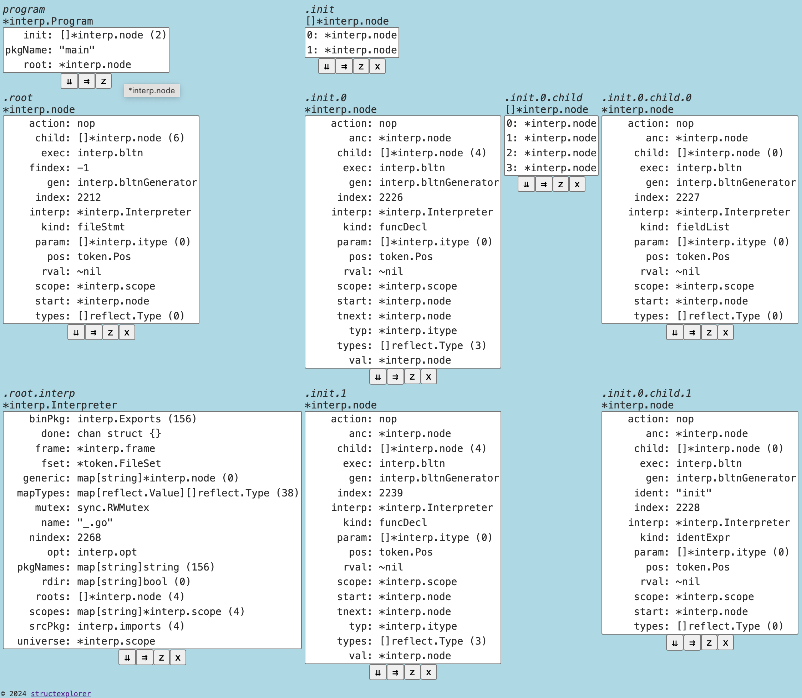

## structexplorer

A Go Struct Explorer Service (http.Handler) that offers remote inspection of any Go struct and its references.

## install

    go get github.com/emicklei/structexplorer

## usage

    structexplorer.NewService("some structure", yourStruct).Start()

or as HTTP Handler:

    s := structexplorer.NewService("some structure", yourStruct)
    http.ListenAndServe(":5656", s)

then a HTTP service will be started

    INFO starting go struct explorer at http://localhost:5656

## syntax

- if a value is a pointer to a standard type then the display value has a "*" prefix
- if a value is a reflect.Value then the display value has a "~" prefix

## buttons

- ⇊ : explore one or more selected values from the list and put them below
- ⇉ : explore one or more selected values from the list and put them on the right
- z : show or hide fields which currently have zero value ("",0,nil,false)
- x : remove the struct from the page

Note: if the list contains just one structural value then selecting it can be skipped for both ⇊ and ⇉.

## examples

See folder `examples` for simple programs.

### example of exploring a [yaegi](https://github.com/traefik/yaegi) program

